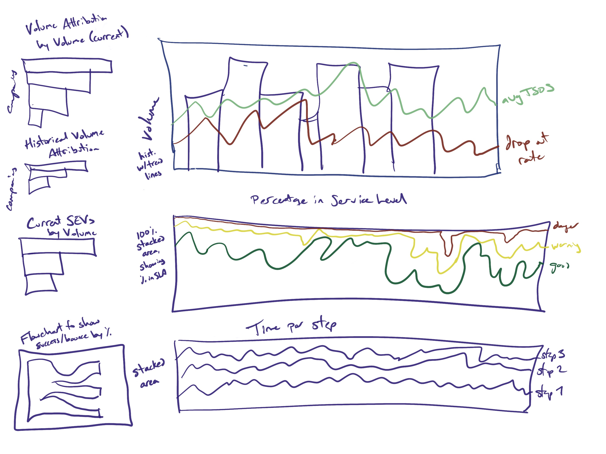

# Data Scientist Exercise
by Katt Kennedy

Thank you all for this fantastic opportunity!

## Scenario 1

### Assumption
For the sake of the mock-up, I assumed data from scenario four was indicative of the type of data desired for the executive dashboard.

### Philosophy

The goal for an executive dashboard is to create a shared truth about business health through KPIs.  Dashboards should inspire conversations about strategy, while giving enough detail to allow discussion of next steps.  For an executive dashboard to be meaningful, it must both be truthful and trusted.

### Strategy
* Build relationships with stakeholders
* Understand how KPIs are currently used and socialized
* Learn about other reports which exist, and what gaps an executive dashboard should fill
* Make a high-level executive dashboard, not a kitchen sink

### Tactics
* Find initial stakeholders, and compare the list of stakeholders with an organization chart to see where gaps may exist
* Make initial introductions and start to build a relationship before moving to large meetings; this is respectful of everyone’s time, so large meetings can be focused instead of a series of one-off conversations
* Confirm data pipelines to the dashboard exist and run cleanly, and create automated checks for potential issues
* Keep in mind the technical level of your stakeholders, and create meaningful data representations at their skill level.  Focus on using graphs instead of numbers alone to allow better comprehension of trends.
* Release graphs as they are made for feedback and stay agile, then slowly grow a dashboard until all executive-level needs are met
* Include links to more detailed dashboard for niche cases so they are both accessible but not cluttering the main dashboard

## Scenario 2

### Philosophy
The goal of this scenario is to never have it happen.  This is a breakdown in communication, both in prioritization and scope.

### Strategy
* Create a sturdy prioritization system able to handle disruptions, and be ready to explain why those priorities are in place
* Build meaningful tools to mine often-requested data easily 
* Communicate early and often with stakeholders; ensure they are aware of current capacity and are not caught unaware if changes occur

### Tactics
 * Reach out directly and immediately to the requestor through a real-time channel to see if this emergency is a true emergency or is imagined, as well as establish basic needs for the request
	- If this is a true emergency, confirm with higher-ups and update other stakeholders with changes to scope and timing as quickly as possible
	- If this is not an emergency, give basic surface information to allow the product manager can do their presentation, while asking politely to give more lead time and details in future requests
* Add meaningful padding into all requests; slow is smooth, smooth is fast
* Pre-build dashboard and back-pocket metrics so fast needs can be serviced with a minimum of interruption to necessary deep work
* Establish a language of KPIs so requests and requirements gathering can go quickly and easily
* Give product managers leeway if the sudden need is a one-off; if this becomes a habit, talk with the product manager and potentially escalate

## Scenario 3

### Exercise Assumptions
* For this exercise, I am assuming the blank check also refers to having a useful, but not ridiculous, amount of time to research and create new systems.

### Philosophy
The goal of KPIs is to create a shared language throughout the organization to communicate success, failure, and potential hazards.  When a complete rewrite is needed, an organizational failure of communication has already happened.

### Strategy
* Gather information about the previous system, and why it failed or needs to be dramatically updated 
* Start conversations throughout the organization to see who would be affected by this change, both end-users and engineering, and start building meaningful rapport
* Be prepared to compromise between a golden vision and a murky reality

### Tactics
* Create a post-mortem for why the previous system failed as a reference document and to ensure everyone feels heard
* Set a timeline for gathering initial requirements and understanding the landscape to prevent analysis paralysis.  This also creates a sense of urgency for stakeholders to think and respond to questions meaningfully.
* Evaluate potential solutions for what will meet technical requirements, and what users will be comfortable using.  Loop in systems teams and vendor management as needed.  
* Confirm whether any issues exist surrounding velocity, volume, or veracity, as well as potential complications surrounding backwards compatibility or regulatory compliance.
* Create and socialize a plan.  Once the plan meets minimal needs and can be scaled to meet most needs, deploy a proof of concept, get feedback, and iterate to create a useful and meaningful solution.
* Document the new system, including the reasons for key decisions; review the design doc regularly, and when key assumptions change, evaluate the system to potentially adjust to the new landscape.  If a previous system has already failed, the next system needs to be anti-fragile.

## Scenario 4

### Exercise Assumptions
* I am assuming the data is relatively clean, and does not have strange oddities I would need to scrub for 

### Limitations
For datasets this size, the main use case will be exploratory to get foundational statistics and be able to find more meaningful questions to ask after the initial analysis.  As well, because of extremes found in the data set and time limitations, analysis was mainly statistical instead of using machine learning.

### Method
First, I opened this in Excel, as the initial data was in .xlsx.  After an initial scan to confirm a lack of data oddities, I loaded this into RStudio.  

Next, I ran summary statistics to see what the data looked like, and grabbed some useful insights (detailed as Data KPIs, below).  Then I looked at peak times, intending to find differences in step length between peak times and low times.  This is when I found the data gap mentioned in limitations.

Once I found this limit, it seemed necessary to follow up further.  That’s when I got a closer look and found a car which seems to have entered at 12:47PM, and left at 1:34PM, and was stuck in `convergence_to_payment` for a staggering 2,607 seconds, or over forty-three minutes.  This represents the largest issue in this data set.  

I had found seven cases over 1000 seconds, then realized that’s sixteen minutes!  If these orders are taking so long, this is a key operational issue.  

### Results
Data KPIs (base):
* Median TSOS: 330s (5min, 30s)
	- 25% TSOS: 199.5s (5min, 30s)
	- 75% TSOS: 492.5s (8min, 12.5s)
	- 95% TSOS: 866s (14m, 26s)
* Bounce Rate: 9%
* Mobile Orders: 13%
* Extreme Length (\>1000s): 3%

In cases of extreme length, the following seemed to be potential factors:
* Mobile orders were disproportionally represented, with over half (4/7) being mobile, while the general population was only 13% of mobile orders.
* `covergence_to_payment` seems to be the largest step difference, with the median time for the population being 5s and the mean for extremely long orders being 1147s; something in this workflow seems to be breaking
* This issue does not seem to be limited to just `convergence_to_payment`, as other orders were hung up at different stages; these may be happenstance, but further follow-up is desirable 

### Next Steps
* Confirm if this extreme long-tail exists in other data sets, or if it is an outlier to this location
* Breakdown differences of median step time between different types of orders
* Create a flowchart to show how and when customers flow through the order process and different timestamps are applied so workflow changes can be easily comprehended
* Potentially, an observational study would help shed light on what is happening to these extreme outliers, and how mobile ordering may be affecting the system